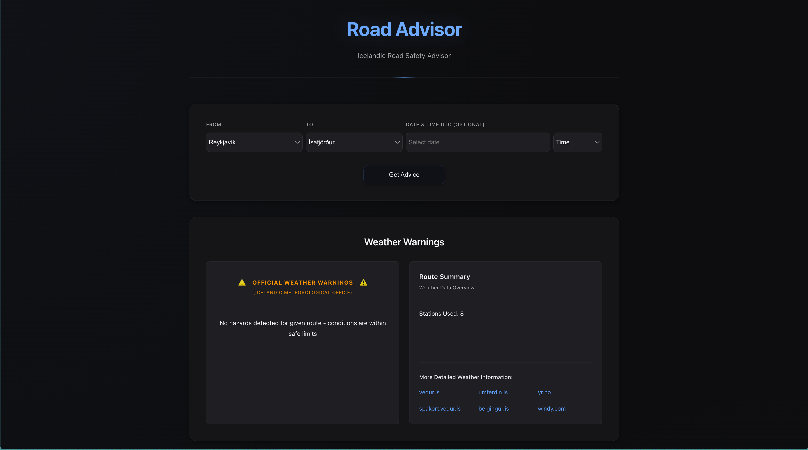
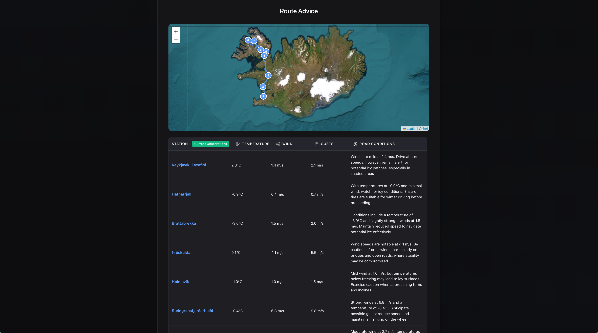

### This project fetches API data from Vegargerðin and Veðurstofa Íslands to provide real-time information about road conditions and weather in Iceland.
Currently fixed on one route Reykjavík ↔ Ísafjörður (due to limitations - school project)
## screenshots of application:

